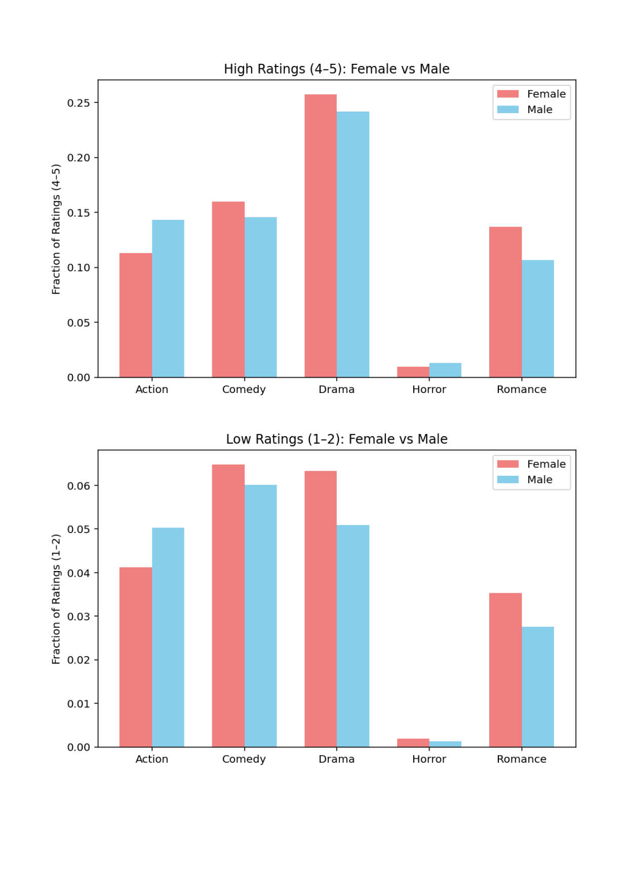
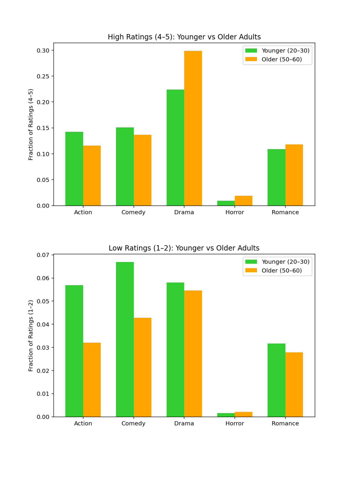
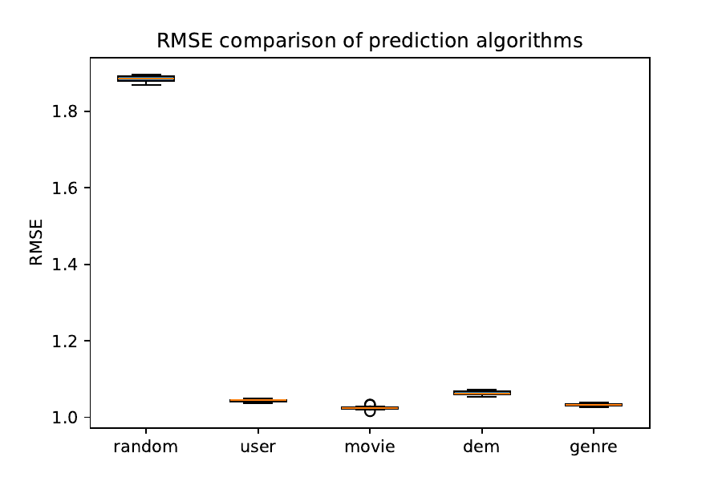
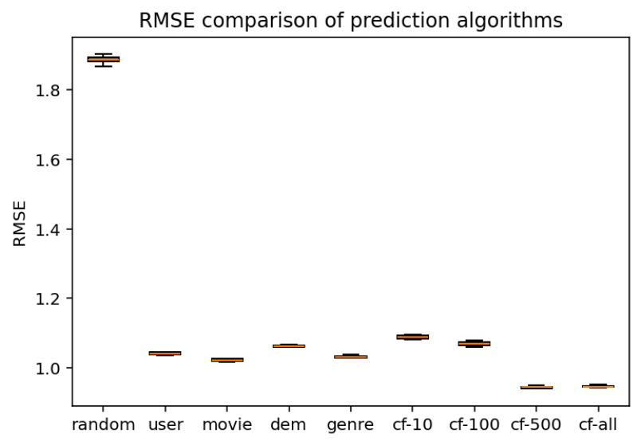

# MovieLens Rating Prediction

A progression of rating-prediction algorithms built on the [MovieLens 100K dataset](https://grouplens.org/datasets/movielens/100k/), developed in phases — starting with basic data loading and demographic analysis, then building up to baseline prediction algorithms, and finally full collaborative filtering. Each phase builds on the previous one, and **Phase 3b is the final, complete version** containing every algorithm from all phases.

## Project structure

```
.
├── phase1/
│   ├── projectPhase1a.py      # Data loading + demographic/genre analysis functions
│   ├── projectPhase1b.py      # Adds bar-chart visualizations of the analysis
│   └── plots/                 # Output plots from this phase
├── phase2/
│   ├── projectPhase2a.py      # Adds 4 baseline prediction algorithms + train/test split + RMSE
│   ├── projectPhase2b.py      # Adds the 10-repetition RMSE evaluation + boxplot
│   └── plots/
├── phase3/
│   ├── projectPhase3a.py      # Adds collaborative filtering (similarity, kNN, CF prediction)
│   ├── projectPhase3b.py      # Full evaluation: all 9 algorithms, 10 reps, final boxplot
│   └── plots/
├── requirements.txt
└── .gitignore
```

Within each phase, the `a` file defines the functions/logic and the `b` file adds the corresponding visualization/evaluation and runs it.

**`phase3/projectPhase3b.py` is the complete, final version of the project** — it contains everything from phases 1–3 in one script.

## Dataset setup

The MovieLens 100K dataset itself is **not included** in this repo (per GroupLens' distribution terms). To run any script:

1. Download `ml-100k.zip` from https://grouplens.org/datasets/movielens/100k/
2. Unzip it into the **repo root** so it sits alongside the phase folders:
   ```
   .
   ├── ml-100k/
   │   ├── u.user
   │   ├── u.item
   │   ├── u.data
   │   ├── u.genre
   │   ├── u.occupation
   │   ├── u.info
   │   └── ...
   ├── phase1/
   ├── phase2/
   ├── phase3/
   └── ...
   ```

**Important:** all scripts reference the data with the relative path `ml-100k/...`, and relative paths in Python are resolved against your *current working directory*, not the script's location. So run scripts **from the repo root**, e.g.:

```bash
python phase3/projectPhase3b.py
```

not from inside the `phase3/` folder.

## Requirements

- Python 3.8+
- matplotlib

```bash
pip install -r requirements.txt
```

## What each phase does

### Phase 1 — Data loading & demographic analysis
Loads users, movies, and ratings into simple list/dict structures, and computes what fraction of ratings in each genre are "high" (4–5) or "low" (1–2), broken down by gender and age group.

`projectPhase1b.py` plots these comparisons:

 

### Phase 2 — Baseline prediction algorithms
Adds four baseline predictors plus a random baseline:
- **random** — random integer 1–5
- **user** — a user's average rating
- **movie** — a movie's average rating
- **dem** — average rating from users of the same gender, within ±5 years of age
- **genre** — average of the user's ratings for movies sharing a genre with the target movie

`projectPhase2b.py` runs 10 repetitions of an 80/20 train/test split and plots RMSE for all 5:



### Phase 3 — Collaborative filtering (final)
Adds Pearson-style user similarity, k-nearest-neighbors, and a CF rating predictor, evaluated at **k = 10, 100, 500, and all users**. `projectPhase3b.py` re-runs the full 10-repetition evaluation across **all 9 algorithms** (the 5 from Phase 2 plus 4 CF variants):



Lower RMSE = better predictions. The CF variants (especially `cf-500` and `cf-all`) outperform the simpler baselines here.

## Notes / limitations

- Each `b` script runs its full experiment as soon as it's executed — there's no `main()` guard around the evaluation loop, so running the script (rather than importing it) is expected.
- No caching of similarity computations across the 10 repetitions in Phase 3, so `projectPhase3b.py` is the slowest script to run (the `cf-all` variant especially).
- Scripts are standalone rather than importing shared code between phases — each phase file redefines the data-loading functions it needs, which is why there's duplication across `a`/`b` files. This mirrors how the project was actually built up phase by phase.

## Author

jonah
